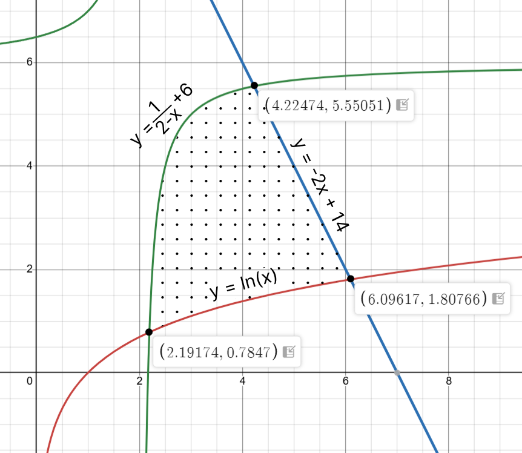

# Лабораторная работа
## *Ользеев Максим, 106 группа*
## Тема: «Сборка многомодульных программ. Вычисление корней уравнений и определенных интегралов».

### Постановка задачи:
С заданной точностью ε = 0.001 вычислить площадь плоской фигуры, ограниченной тремя кривыми, уравнения
которых:
- y = ln(x)
- y = -2x + 14
- y = 1 / (2 - x) + 6

### Шаги решения:
- С некоторой точностью ε1 вычислить абсциссы точек пересечения кривых, используя комбинированный метод хорд и касательных.
- Представить площадь заданной фигуры как алгебраическую сумму определенных интегралов и вычислить эти интегралы с некоторой точностью ε2 по формуле Симпсона (парабол).
- Подобрать величины ε1 и ε2 вручную так, чтобы гарантировалось вычисление площади фигуры с точностью ε.

*Вариант задания: 7, комбинированный, метод Симпсона*

